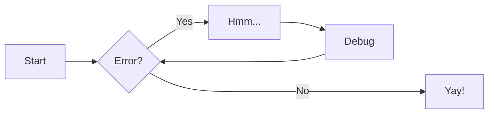
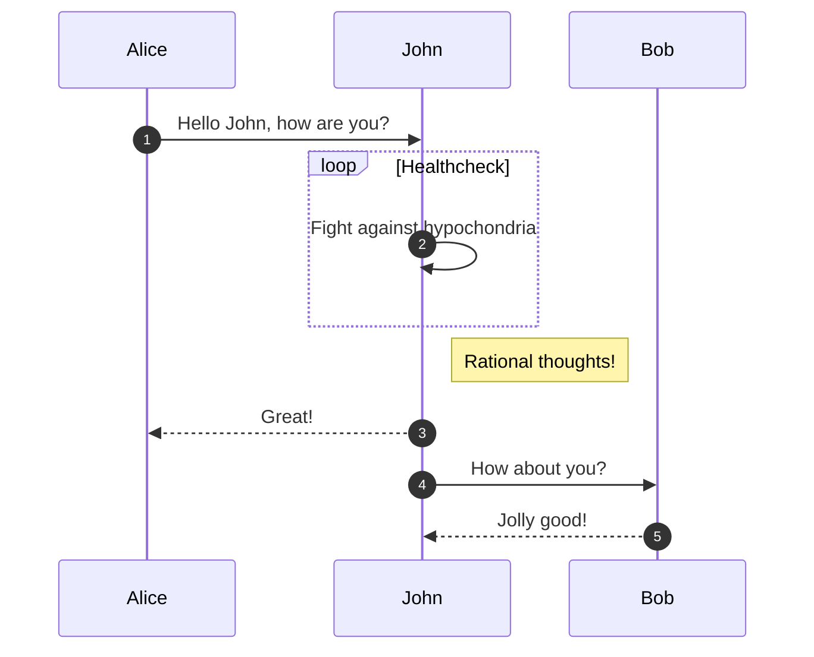
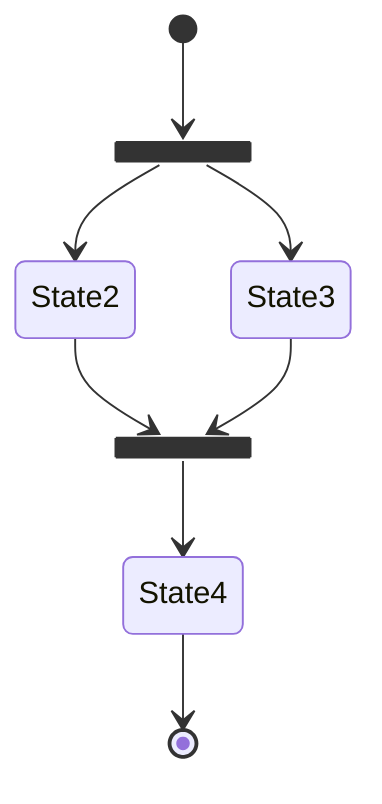

# Sections

To have finished by 2 weeks (March 7th before class).

## Introduction

Welcome! 🙌 This document will guide you through how to master and beat the git bosses of VScode. You will travel long reaches and fight many foes. This guide is for thouse who are daring enough to battle.

Welcome! 👋This documentation will guide you through how to set up a [GitHub](github.com) repository and submodules inside of a repository using VsCode.

### intended users

this guide is for...

### typographic conventions

#### info, warning, error and success

blue/cyan, yellow, red and green (check light/dark theme)

Use _Success_ when a command has **no output** to help confirm to a user that they are on the right track.

#### Code Blocks/Command Line Format

In `~/school`:

```
git init
```

```
git add .
```

#### Folder Structure

Figure out how the user should set up their folders. We can let them do it their own way.

Can't have large files in git. Need to warn use about that.

#### Prerequesites

In order to follow along with this guide, you will need a code editor, a GitHub account and a command-line shell.

#### Quick Usage?

Summary for more experienced users who already understand git.

## Initializing Repository

### Setting up folder structure

Potentially:

Setup a school folder.

**Info part**: Users can use any already existing folder structure they want, but we recommend a system for users without one.

Recommended system:

    1. Setup school folder
    2. Add term number (term 1)
    3. Add classes as they come
    4. In a class folder, add c1/c2 for classes, l1/l2 for labs
    5. go into details

### Setting up .git

Technical parts for setting up the initial git, adding and connecting to remote, setting up the remote on github.

If you have an existing folder for school, we give some information about

Talk about ssh for credential helper, warn against config helper

## Using Repository

Dealing with git add, git commit and git push

Potentially setting up a script that automatically does thit

## Submodules/Advanced Git

Leave this for last

### Understanding Idea

So what/why are we going through the trouble to do this

## Troubleshooting

Any errors or issues the user runs into in the documentation should lead you here.

| Symptom | Probable Cause | Recommended Action |
| ------- | -------------- | ------------------ |
| Symptom | Probable Cause | Recommended Action |

### cd to the correct folder

Type **cd** followed by a space and your folder name into your command-line:
`cd <your_folder_name>`

> [!TIP] Hello This is a tip you can use 

### having your shell setup correctly (git bash)

## Quick Usage

A quick script to run to both connect repository and push existing code:

```
echo "# example" >> README.md
git init
git add README.md
git commit -m "first commit"
git branch -M main
git remote add origin https://github.com/<username>/example.git
git push -u origin main
```

## Glossary

[`glossary`](#)






