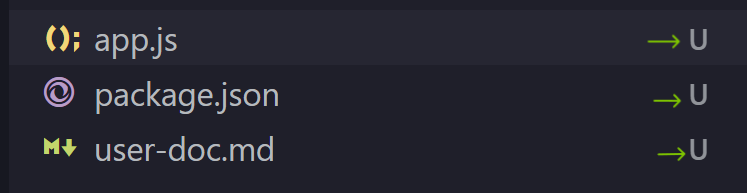
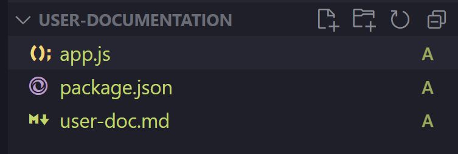
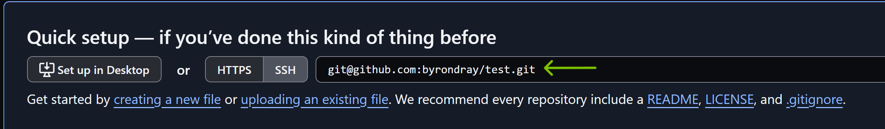

# How to Initialize a Repository on GitHub

This section will focus on helping you initialize your GitHub repository. After you read this section, you will be able to setup a new GitHub repository for future projects.

## Quick Usage

For those experienced in setting up repositories:

```
echo "# example" >> README.md
git init
git add README.md
git commit -m "first commit"
git branch -M main
git remote add origin https://github.com/<username>/example.
git push -u origin main
```

## Setps to get started

In the introduction, you created a GitHub account and now you will be using that account to initialize your GitHub repository. You will be using a shell that was mentioned in the introduction.

### Create a New Repository

- Click the `+` icon in the upper-right corner and select _New repository_.

- Or, go to [https://github.com/new](https://github.com/new).

### Configure Your Repository

Fill out the details of your repository:

- **Repository name**: Choose a unique name that reflects your project.
- **Visibility**: Select whether the repository is Public or Private.

### Create the Repository

Click the `Create repository` button.

### Navigate to the Source Directory (or create one)

1. Open Git Bash (or another shell) and run `cd <path name>` to navigate to the source directory of your project.

- Example: `cd c:/users/user/bcit/comp1310/<directory name>`

2. If you do not have a source directory for your project, you can create one by running:

- `mkdir <folder name>`
- Make sure to `cd` into the directory after you create it

## Push Your Project to GitHub

If you have a local repository to push:

### Initialize Repository

!!! warning "Warning"

      Make sure you are in the source directory of your project before running the next command. Failing to do so could hinder your conputers performance. If you made this mistake find a solution in the troubleshooting section.

```sh
# Initialize your local directory as a Git repository
git init
```

!!! success

    You will know this command ran succesfully if you look at the Explorer in VScode and see a ***U*** beside the files. This means the files were added but they are *Untracked* by GitHub. 

    

### Stage New Files

```sh
# Add the files in your new local repository
# The "." allows you to upload all files in your current working directory.
git add .
```

!!! success

    You will know this command ran succesfully if you look at the Explorer in VScode and see a ***A*** beside the files. This means the files were *Added* to the staging area.

    

### Commit the files that you've staged in your local repository

```sh

git commit -m "First commit"

```

!!! success

    The feedback in the command line will indicate whether the command worked or not. This is what a succesful output looks like.

    ```sh
    user@DellXPS MINGW64 ~/Term2/Comm/user-documentation (main)
    $ git commit -m "write a meaningful commit message"
    [main 82a23ad] write a meaningful commit message
    1 file changed, 1 insertion(+)
    ```

### Add Remote Origin

```sh
# Add the URL for the remote repository
git remote add origin <REMOTE_URL>
```

!!! info "Remote Url"

    You Remote Url is located in your GitHub repository. Copy and paste it into the command below.

    

### Push Changes to GitHub

```sh
# Push the changes in your local repository to GitHub
git push -u origin master
```

!!! info "Master or Main"

    If the command below does not work for you, replace `master` with `main` and try again.

!!! success

    :white_check_mark: Congrats! Your project is now in GitHub. :white_check_mark:
    

## Conclusion

In this section, you have learned how to:

- Create a new GitHub repository
- Navigate to the directory on you computer
- Initialize your project with GitHub
- Add, commit and push your project to the GitHub repository

Nice work! :white_check_mark: You can now move onto the next section, [How to use your repository](useRepo.md).
